# DeTrust — UML Class Diagram (Mermaid)

> Follows the class diagram syntax rules from **Table C-2**:
> - Attributes: `-attributeName`
> - Operations: `+operationName()`
> - Associations labeled with multiplicity `0..*`, `1..1`, etc.
> - **Composition** (`*--`) — physical "part-of" (child cannot exist without parent, `onDelete: Cascade`)
> - **Aggregation** (`o--`) — logical "part-of" (child can exist independently)
> - **Association** (`--`) — plain directional relationship
> - **Generalization** not used (no inheritance in schema)

```mermaid
classDiagram

%% ─── USER DOMAIN ────────────────────────────────────────────────────────────

class User {
  -id : String
  -walletAddress : String
  -email : String
  -passwordHash : String
  -name : String
  -avatarUrl : String
  -role : UserRole
  -status : UserStatus
  -emailVerified : Boolean
  -twoFactorEnabled : Boolean
  -twoFactorSecret : String
  -nonce : String
  -kycStatus : KycStatus
  -kycDocumentType : String
  -kycIdNumber : String
  -kycCountry : String
  -lastLoginAt : DateTime
  -createdAt : DateTime
  -updatedAt : DateTime
  +register()
  +login()
  +verifyEmail()
  +enableTwoFactor()
  +updateProfile()
  +changeRole()
  +deactivate()
}

class Session {
  -id : String
  -userId : String
  -token : String
  -ipAddress : String
  -userAgent : String
  -expiresAt : DateTime
  -createdAt : DateTime
  +isExpired()
  +invalidate()
}

class FreelancerProfile {
  -id : String
  -userId : String
  -title : String
  -bio : String
  -hourlyRate : Decimal
  -availability : String
  -location : String
  -timezone : String
  -languages : String[]
  -portfolioLinks : String[]
  -resumeUrl : String
  -linkedinUrl : String
  -githubUrl : String
  -websiteUrl : String
  -trustScore : Decimal
  -aiCapabilityScore : Decimal
  -totalEarnings : Decimal
  -completedJobs : Int
  -successRate : Decimal
  -avgRating : Decimal
  -totalReviews : Int
  -profileComplete : Boolean
  -completenessScore : Int
  -createdAt : DateTime
  -updatedAt : DateTime
  +updateScores()
  +calculateCompletenessScore()
}

class ClientProfile {
  -id : String
  -userId : String
  -companyName : String
  -companySize : String
  -industry : String
  -companyWebsite : String
  -description : String
  -location : String
  -trustScore : Decimal
  -totalSpent : Decimal
  -jobsPosted : Int
  -hireRate : Decimal
  -avgRating : Decimal
  -totalReviews : Int
  -paymentVerified : Boolean
  -profileComplete : Boolean
  -completenessScore : Int
  -createdAt : DateTime
  -updatedAt : DateTime
  +updateScores()
  +verifyPayment()
}

class TrustScoreHistory {
  -id : String
  -userId : String
  -score : Decimal
  -breakdown : Json
  -createdAt : DateTime
  +getBreakdown()
}

class SecureFile {
  -id : String
  -userId : String
  -category : SecureFileCategory
  -visibility : SecureFileVisibility
  -storageProvider : String
  -cid : String
  -filename : String
  -mimeType : String
  -size : Int
  -checksum : String
  -encryptionAlgorithm : String
  -encryptionSalt : String
  -encryptionIv : String
  -encryptionAuthTag : String
  -resourceType : SecureFileResourceType
  -resourceId : String
  -metadata : Json
  -createdAt : DateTime
  -updatedAt : DateTime
  +decrypt()
  +changeVisibility()
}

%% ─── SKILLS & VERIFICATION ──────────────────────────────────────────────────

class Skill {
  -id : String
  -name : String
  -slug : String
  -category : String
  -description : String
  -isActive : Boolean
  -createdAt : DateTime
  -updatedAt : DateTime
  +activate()
  +deactivate()
}

class FreelancerSkill {
  -id : String
  -freelancerProfileId : String
  -skillId : String
  -yearsExperience : Int
  -proficiencyLevel : Int
  -verificationStatus : SkillVerificationStatus
  -verifiedAt : DateTime
  -verificationScore : Int
  -createdAt : DateTime
  -updatedAt : DateTime
  +verify()
  +updateProficiency()
}

class Certification {
  -id : String
  -freelancerProfileId : String
  -name : String
  -issuer : String
  -issueDate : DateTime
  -expiryDate : DateTime
  -credentialId : String
  -credentialUrl : String
  -createdAt : DateTime
  -updatedAt : DateTime
  +isExpired()
}

class Education {
  -id : String
  -freelancerProfileId : String
  -institution : String
  -degree : String
  -fieldOfStudy : String
  -startDate : DateTime
  -endDate : DateTime
  -description : String
  -createdAt : DateTime
  -updatedAt : DateTime
}

class Experience {
  -id : String
  -freelancerProfileId : String
  -title : String
  -company : String
  -location : String
  -startDate : DateTime
  -endDate : DateTime
  -isCurrent : Boolean
  -description : String
  -createdAt : DateTime
  -updatedAt : DateTime
}

class SkillTest {
  -id : String
  -skillId : String
  -name : String
  -description : String
  -questions : Json
  -timeLimit : Int
  -passingScore : Int
  -isActive : Boolean
  -createdAt : DateTime
  -updatedAt : DateTime
  +attempt()
  +grade()
  +activate()
}

class SkillTestAttempt {
  -id : String
  -testId : String
  -userId : String
  -answers : Json
  -score : Int
  -passed : Boolean
  -timeTaken : Int
  -completedAt : DateTime
  +isPassed()
}

%% ─── JOB DOMAIN ─────────────────────────────────────────────────────────────

class Job {
  -id : String
  -clientId : String
  -title : String
  -description : String
  -category : String
  -type : JobType
  -budget : Decimal
  -hourlyRateMin : Decimal
  -hourlyRateMax : Decimal
  -estimatedHours : Int
  -deadline : DateTime
  -status : JobStatus
  -visibility : String
  -experienceLevel : String
  -attachments : String[]
  -proposalCount : Int
  -viewCount : Int
  -publishedAt : DateTime
  -createdAt : DateTime
  -updatedAt : DateTime
  +publish()
  +cancel()
  +markInProgress()
  +markCompleted()
}

class JobSkill {
  -id : String
  -jobId : String
  -skillId : String
  -isRequired : Boolean
  -createdAt : DateTime
}

%% ─── PROPOSAL DOMAIN ────────────────────────────────────────────────────────

class Proposal {
  -id : String
  -jobId : String
  -freelancerId : String
  -coverLetter : String
  -proposedRate : Decimal
  -estimatedDuration : String
  -milestones : Json
  -attachments : String[]
  -status : ProposalStatus
  -clientNote : String
  -createdAt : DateTime
  -updatedAt : DateTime
  +submit()
  +withdraw()
  +accept()
  +reject()
  +shortlist()
}

%% ─── CONTRACT DOMAIN ────────────────────────────────────────────────────────

class Contract {
  -id : String
  -jobId : String
  -proposalId : String
  -clientId : String
  -freelancerId : String
  -title : String
  -description : String
  -totalAmount : Decimal
  -status : ContractStatus
  -billingType : String
  -hourlyRate : Decimal
  -weeklyHourLimit : Int
  -escrowAddress : String
  -blockchainJobId : String
  -fundingTxHash : String
  -startDate : DateTime
  -endDate : DateTime
  -completedAt : DateTime
  -cancelledAt : DateTime
  -createdAt : DateTime
  -updatedAt : DateTime
  +activate()
  +complete()
  +cancel()
  +openDispute()
  +fundEscrow()
}

class Milestone {
  -id : String
  -contractId : String
  -title : String
  -description : String
  -amount : Decimal
  -orderIndex : Int
  -status : MilestoneStatus
  -dueDate : DateTime
  -deliverableHash : String
  -deliverableUrl : String
  -deliverableNote : String
  -revisionNote : String
  -revisionCount : Int
  -paymentTxHash : String
  -submittedAt : DateTime
  -approvedAt : DateTime
  -paidAt : DateTime
  -createdAt : DateTime
  -updatedAt : DateTime
  +submit()
  +approve()
  +requestRevision()
  +releasePayment()
}

class TimeEntry {
  -id : String
  -milestoneId : String
  -date : DateTime
  -hours : Decimal
  -description : String
  -createdAt : DateTime
  -updatedAt : DateTime
  +logHours()
}

%% ─── REVIEW DOMAIN ──────────────────────────────────────────────────────────

class Review {
  -id : String
  -contractId : String
  -authorId : String
  -subjectId : String
  -overallRating : Decimal
  -communicationRating : Decimal
  -qualityRating : Decimal
  -timelinessRating : Decimal
  -professionalismRating : Decimal
  -comment : String
  -responseText : String
  -responseAt : DateTime
  -ipfsHash : String
  -blockchainTxHash : String
  -isPublic : Boolean
  -createdAt : DateTime
  -updatedAt : DateTime
  +respond()
  +publishToBlockchain()
}

%% ─── DISPUTE DOMAIN ─────────────────────────────────────────────────────────

class Dispute {
  -id : String
  -contractId : String
  -initiatorId : String
  -reason : String
  -description : String
  -evidence : String[]
  -status : DisputeStatus
  -outcome : DisputeOutcome
  -resolution : String
  -clientVotes : Int
  -freelancerVotes : Int
  -votingDeadline : DateTime
  -blockchainDisputeId : String
  -resolutionTxHash : String
  -resolvedAt : DateTime
  -createdAt : DateTime
  -updatedAt : DateTime
  +openVoting()
  +resolve()
  +appeal()
  +tallyVotes()
}

class DisputeEvidence {
  -id : String
  -disputeId : String
  -uploadedById : String
  -url : String
  -cid : String
  -fileName : String
  -fileSize : Int
  -description : String
  -createdAt : DateTime
  +upload()
}

class DisputeVote {
  -id : String
  -disputeId : String
  -jurorId : String
  -vote : DisputeOutcome
  -weight : Int
  -reasoning : String
  -createdAt : DateTime
  +castVote()
}

%% ─── COMMUNICATION DOMAIN ───────────────────────────────────────────────────

class Message {
  -id : String
  -senderId : String
  -receiverId : String
  -jobId : String
  -content : String
  -attachments : String[]
  -readAt : DateTime
  -createdAt : DateTime
  -updatedAt : DateTime
  +send()
  +markRead()
}

class Notification {
  -id : String
  -userId : String
  -type : NotificationType
  -title : String
  -message : String
  -data : Json
  -read : Boolean
  -readAt : DateTime
  -createdAt : DateTime
  +markRead()
  +dismiss()
}

%% ─── RELATIONSHIPS ───────────────────────────────────────────────────────────
%% Composition (*--): child physically cannot exist without parent (onDelete: Cascade)
%% Aggregation (o--): logical part-of, child can exist independently
%% Association (-->): plain directional reference

%% User ─── has one ─── Session (Cascade → Composition)
User "1..1" *-- "0..*" Session : owns

%% User ─── has one ─── FreelancerProfile (Cascade → Composition)
User "1..1" *-- "0..1" FreelancerProfile : has

%% User ─── has one ─── ClientProfile (Cascade → Composition)
User "1..1" *-- "0..1" ClientProfile : has

%% User ─── TrustScoreHistory (Cascade → Composition)
User "1..1" *-- "0..*" TrustScoreHistory : records

%% User ─── SecureFile (Cascade → Composition)
User "1..1" *-- "0..*" SecureFile : stores

%% User ─── posts ─── Job
User "1..1" --> "0..*" Job : posts

%% User ─── submits ─── Proposal
User "1..1" --> "0..*" Proposal : submits

%% User ─── participates ─── Contract (as client)
User "1..1" --> "0..*" Contract : hires as client

%% User ─── participates ─── Contract (as freelancer)
User "1..1" --> "0..*" Contract : works as freelancer

%% User ─── writes ─── Review
User "1..1" --> "0..*" Review : authorsReview

%% User ─── receives ─── Review
User "1..1" --> "0..*" Review : receivesReview

%% User ─── initiates ─── Dispute
User "1..1" --> "0..*" Dispute : initiates

%% User ─── casts ─── DisputeVote
User "1..1" --> "0..*" DisputeVote : votes

%% User ─── uploads ─── DisputeEvidence
User "1..1" --> "0..*" DisputeEvidence : uploads

%% User ─── sends ─── Message
User "1..1" --> "0..*" Message : sends

%% User ─── receives ─── Message
User "1..1" --> "0..*" Message : receives

%% User ─── Notification (Cascade → Composition)
User "1..1" *-- "0..*" Notification : notified

%% FreelancerProfile ─── FreelancerSkill (Cascade → Composition)
FreelancerProfile "1..1" *-- "0..*" FreelancerSkill : has

%% FreelancerProfile ─── Certification (Cascade → Composition)
FreelancerProfile "1..1" *-- "0..*" Certification : holds

%% FreelancerProfile ─── Education (Cascade → Composition)
FreelancerProfile "1..1" *-- "0..*" Education : lists

%% FreelancerProfile ─── Experience (Cascade → Composition)
FreelancerProfile "1..1" *-- "0..*" Experience : lists

%% Skill ─── FreelancerSkill (join entity, Cascade)
Skill "1..1" --> "0..*" FreelancerSkill : taggedIn

%% Skill ─── JobSkill (join entity, Cascade)
Skill "1..1" --> "0..*" JobSkill : requiredBy

%% Skill ─── SkillTest (logical aggregation)
Skill "1..1" o-- "0..*" SkillTest : testedBy

%% SkillTest ─── SkillTestAttempt (Cascade → Composition)
SkillTest "1..1" *-- "0..*" SkillTestAttempt : attempted

%% Job ─── JobSkill (Cascade → Composition)
Job "1..1" *-- "0..*" JobSkill : requires

%% Job ─── Proposal (Cascade → Composition)
Job "1..1" *-- "0..*" Proposal : receives

%% Job ─── Contract (aggregation, no cascade)
Job "1..1" o-- "0..1" Contract : resultedIn

%% Job ─── Message (optional context)
Job "0..1" o-- "0..*" Message : discussed

%% Proposal ─── Contract (aggregation)
Proposal "1..1" o-- "0..1" Contract : formalized

%% Contract ─── Milestone (Cascade → Composition)
Contract "1..1" *-- "0..*" Milestone : contains

%% Contract ─── Dispute (Cascade → Composition)
Contract "1..1" *-- "0..*" Dispute : hasDispute

%% Contract ─── Review (Cascade → Composition)
Contract "1..1" *-- "0..*" Review : hasReview

%% Milestone ─── TimeEntry (Cascade → Composition)
Milestone "1..1" *-- "0..*" TimeEntry : logs

%% Dispute ─── DisputeVote (Cascade → Composition)
Dispute "1..1" *-- "0..*" DisputeVote : collects

%% Dispute ─── DisputeEvidence (Cascade → Composition)
Dispute "1..1" *-- "0..*" DisputeEvidence : contains
```

